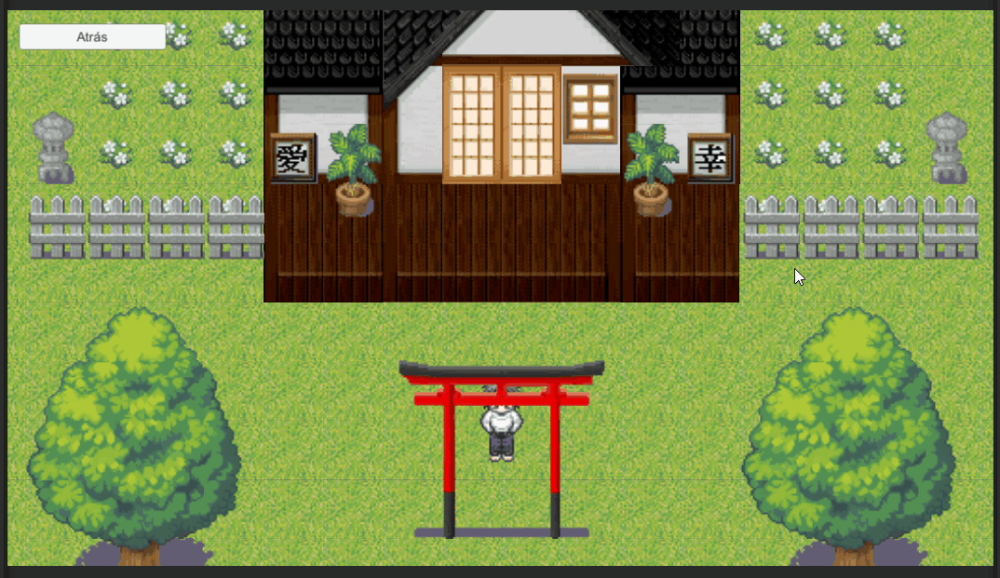
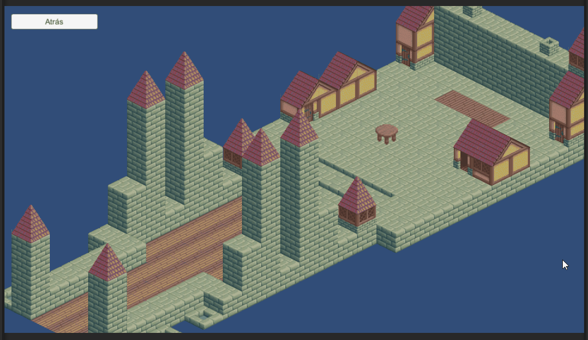
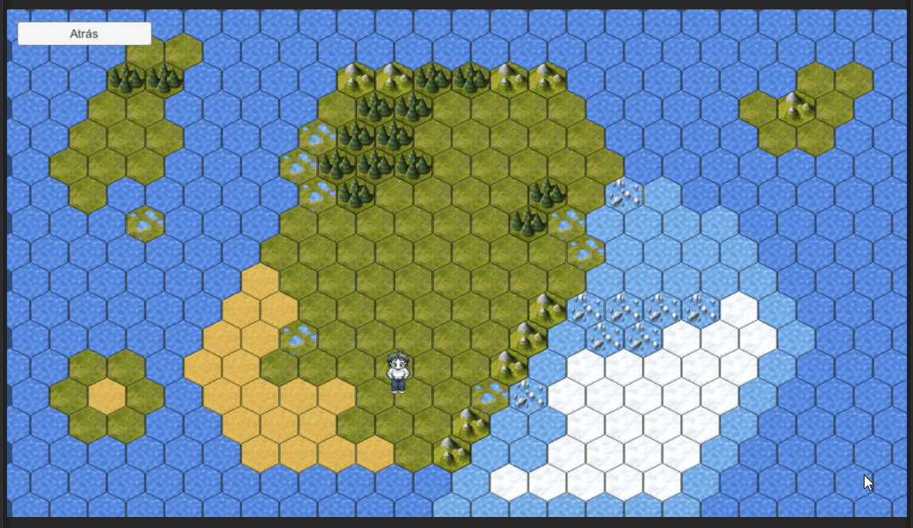
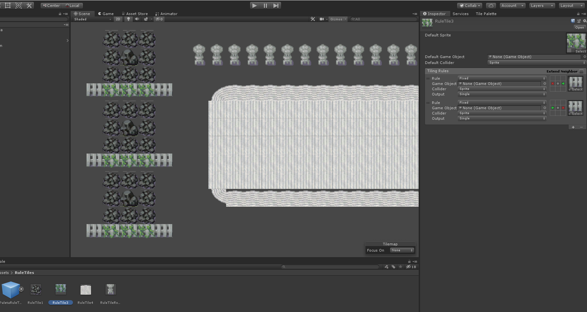

# Generación de Tile maps
---
**Demostración:**
1. Generación de tilemaps 2D, con colisiones y personaje movible.

2. Generación de un mapa isométrico, con alturas, colisiones y personaje (mesa).

3. Generación de un mapa hexagonal, con colisiones y personaje.

4. Generación de ruletiles. Es una prueba donde se ha generado varios.

